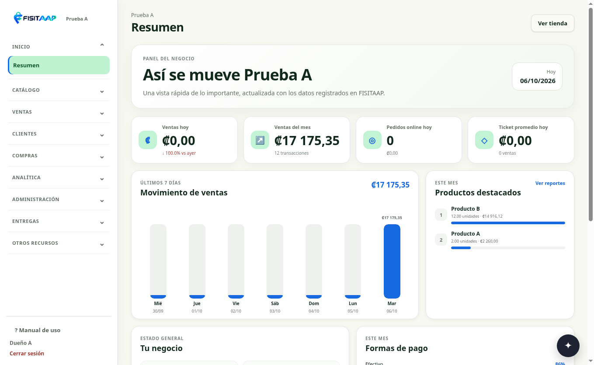
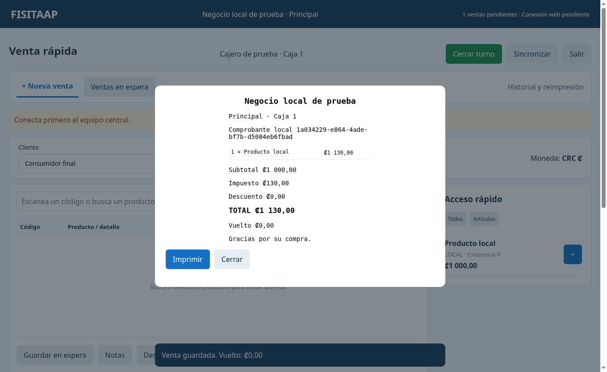

# FISITAAP Escritorio 1.7.3

Con internet, el programa abre **el sistema web real dentro de su ventana**, con las mismas pantallas, datos, menú y funciones que usas desde el navegador. Cada usuario conserva los permisos de su cuenta. La caja local queda disponible para buscar y vender cuando la web no responda.

[**Descargar instalador para Windows de 64 bits**](https://raw.githubusercontent.com/fisitalmultiservicios-svg/FISITAAP/main/actualizaciones/1.7.3/FISITAAP-Escritorio-1.7.3-Windows-x64.exe)

## Actualizar

1. Termina y confirma cualquier venta en curso y cierra FISITAAP.
2. Instala 1.7.3 en la misma carpeta que la versión anterior. Conserva los datos, las ventas, los respaldos y la conexión del negocio.
3. Actualiza primero el equipo central y después las otras cajas.
4. Abre FISITAAP. Si tu negocio ya está conectado y la web responde, aparecerá el sistema completo. Ingresa con el mismo correo y contraseña que usas en la web.

Esta entrega se instala en Windows. La web continúa con [1.7.0-R3](../1.7.0-R3/README.md); no necesitas subir otra actualización a cPanel por este cambio.

## Los dos botones de la parte superior

| Botón | Uso |
|---|---|
| **Sistema completo** | La aplicación web con todos los módulos disponibles para tu cuenta: catálogo, ventas, mesas, clientes, compras, inventario, reportes y administración, entre otros. Utiliza tu acceso normal de la web. |
| **Caja local** | Buscar productos, cobrar y guardar ventas en el equipo central cuando se necesite trabajar sin internet. Utiliza el cajero autorizado y su contraseña local. |

El programa comprueba la conexión y muestra un aviso cuando la web deja de responder. Si el corte ocurre con la web abierta, conserva esa pantalla y te permite elegir **Caja local**. Revisa cualquier cobro web sin confirmar antes de cobrarlo de nuevo en la caja local.

Si abres el programa sin internet, se muestra la caja local. Cuando vuelve la conexión, no sustituye la venta local que estás preparando: termina esa venta y pulsa **Sistema completo** cuando quieras regresar. El programa intenta sincronizar las ventas locales antes de volver a la web. Si quedan operaciones pendientes, resuélvelas o pulsa **Sincronizar** desde la caja local y vuelve a intentar.

Los cambios de modo conservan ambas pantallas y sus sesiones. Los módulos completos usan la web y requieren conexión; la caja local conserva las funciones sin internet que ya tenías. La primera entrada al sistema web requiere tu acceso normal; el código del equipo no sustituye tu cuenta web.

Para varias cajas, el equipo central y el router deben permanecer encendidos. Las otras computadoras siguen usando ese mismo equipo central para las operaciones locales. Si necesitas configurar una caja nueva, usa **FISITAAP → Conectar a otro equipo central** y el archivo de conexión del central.

La impresión se realiza sobre la pantalla que estés usando. Conserva la configuración de impresoras de Windows; los ajustes específicos de impresión de la web siguen siendo los mismos del sistema web.

## Vista de la copia de prueba

Para revisar la entrega: [comprobaciones](COMPROBACIONES.md), [código fuente](FUENTES-FISITAAP-Escritorio-1.7.3.zip) y [sumas de verificación](SHA256SUMS.txt).
