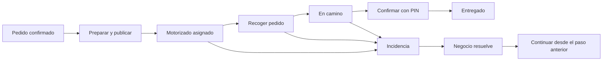

# Revisión profunda de FISITAAP

**6 de octubre de 2026, Costa Rica.** Entrega web acumulativa **1.7.4-QA** y Windows **1.7.4**.

Se revisaron las funciones, los datos y la lógica de uso en una copia aislada, con negocios, clientes y ventas ficticios. Se corrigieron **17 problemas** y se añadieron mejoras de uso. Las comprobaciones finales ejecutadas aquí están recogidas en [RESULTADOS-QA.json](RESULTADOS-QA.json).

Esta revisión no instala cambios en tu HostGator ni sustituye las pruebas con tus computadoras, teléfonos e impresoras. La entrega conserva los cambios web anteriores R1, R2 y R3; la instalación reconoce las cuatro copias revisadas y se detiene ante archivos modificados por otra vía. Se usó el PDF de reestructuración como referencia para las funciones y recorridos; esto no certifica que cada pantalla sea idéntica píxel por píxel a sus imágenes.

## Qué se comprobó

| Entorno | Comprobación y alcance |
|---|---|
| Web | PHP 8.3, Apache y MariaDB 11.4 en contenedores aislados. **130 casos ampliados**, además de las suites anteriores de regresión. Solicitudes HTTP reales, comprobaciones de base de datos y pruebas en Chromium. |
| Varias cajas | Venta simultánea de la última unidad, dos cobros de la misma cuenta, competencia por un saldo de regalo y asignación simultánea de entregas. |
| Caja local | **38 pruebas Node**: 29 de regresión y 9 ampliadas. Incluyen 50 solicitudes simultáneas, 125 ventas pendientes en lotes de 100 y 25, 101 turnos, reinicios, conservación de datos y carreras durante conexión y sincronización. |
| Cálculo de precios | **1.500 comparaciones** entre los cálculos reales de JavaScript y PHP. Impuestos, precios con/sin IVA, cantidades fraccionarias, extras, combos, descuentos y promociones coincidieron en centavos y movimientos de existencias. |
| Escritorio | Electron real en Linux con pantalla virtual: web completa dentro de la ventana, pérdida y recuperación de conexión, conservación de la venta y sesiones. El transporte de sincronización se simula en esta prueba; otra suite lo comprueba contra PHP real. |
| Impresión Windows | Nombres exactos del controlador, envío directo sin diálogo, errores y selección de papel comprobados con un sustituto del controlador. Electron real generó PDF de 58 y 80 mm, con acentos y símbolo ₡. **El controlador físico de Windows y el papel siguen pendientes.** |
| Android | **9 pruebas Java** sin fallos. Tres ejecutan las clases reales de impresión, gráficos Android API 35 y envío TCP a un receptor de prueba, con papel de 58/80 mm, corte y prevención de duplicados. Revisión estática sin errores, con 8 advertencias existentes. |
| Web dentro de Android | Chromium con el canal nativo simulado: menú, recibo automático, copia explícita, comandas por zona y venta local. **La instalación y el recorrido completo dentro de WebView en un teléfono real siguen pendientes.** |
| Pantallas | **36 revisiones**: 12 pantallas a tamaños de computadora, tablet y teléfono. Sin errores PHP/JavaScript ni desbordamiento horizontal de toda la página en esas vistas. |
| Actualización cPanel | Instalación desde original, R1, R2 y R3; autorización, integridad, carpetas protegidas, instalación repetida, conservación de configuración y roles, vuelta atrás y bloqueo de restauración después de datos nuevos. |
| Paquetes | ZIP y EXE íntegros; el código extraído del instalador Windows coincide con los archivos revisados. Huellas SHA256 y revisión para excluir configuración, credenciales, medios y datos del negocio. |

Las cifras corresponden a suites distintas y no se suman como si fueran casos independientes. Las pruebas de concurrencia descritas comprueban escenarios concretos; no son una certificación de capacidad para una cantidad ilimitada de usuarios.

## Cobertura de funciones

| Funciones del sistema y del PDF | Qué se ejercitó |
|---|---|
| Maestro, negocios, planes y suscripciones | Pantallas, creación de negocio y sucursal principal, usuario dueño, vencimiento, suspensión y reapertura; aislamiento respecto a usuarios de negocios. |
| Usuarios y roles | Acceso por rol, permisos de consultar/modificar/cobrar/configurar, cuentas desactivadas, contraseña temporal obligatoria, recuperación de acceso y rechazo de IDs de otro negocio. |
| Página oficial y página del negocio | Edición desde paneles, catálogo, secciones, preguntas frecuentes, menú, contenido y diseño responsive. Proveedores externos de multimedia no se prueban como servicios reales. |
| Catálogo | Categorías, productos, edición, inventario inicial, extras, opcionales, combos, promociones, cupones y precios por sucursal; rechazo de categorías, productos y sucursales ajenos. |
| Pedidos web y clientes | Compra, registro simplificado, consumidor final, asociación al negocio, historial, búsqueda, cancelación y devolución única de inventario/saldo de regalo. No se envían mensajes reales por WhatsApp. |
| POS y cobro | Venta rápida, cuentas, productos, notas, cambios de cantidad, cuentas en espera, cobro completo/dividido, efectivo, tarjeta, SINPE, pago mixto, crédito autorizado y recibos. Tarjeta/SINPE registran el medio elegido; no se hizo un cobro bancario real. |
| Mesas y salones | Vista básica y gráfica, apertura de cuenta, edición del plano, sectores, servicio, objetos, mover/unir cuentas y rechazo de modificaciones de diseño obsoletas. |
| Inventario, compras, CXC y CXP | Ajustes fraccionarios, reserva/devolución, compras manuales/XML, proveedores, abonos, saldos, límites de crédito y aislamiento entre negocios. |
| Fidelización y regalos | Emisión, recarga, uso parcial, saldo restante, repetición del cobro, devolución al cancelar y competencia entre cajas; puntos asociados a una entrega confirmada una sola vez. |
| Express y motorizados | Registro, perfil, solicitud/aprobación de afiliación, alcance de sucursales, publicación, asignación, recogida, ruta, PIN, incidencias, cancelación y cierre manual desde el negocio. |
| Reportes y auditoría | Pantallas, filtros, KPI, reportes globales y **19 conjuntos de exportación**; protección ante fórmulas de hoja de cálculo y texto HTML/SQL ingresado por usuarios. |
| FISIChat y ayuda | Pantallas, perfiles, contexto disponible y límites de acceso. Las respuestas del proveedor de IA real quedan pendientes de una configuración real del servicio. |
| Impresión y conexión local | Perfiles, recibos/comandas, varias zonas, papel 58/80, duplicados, errores, recuperación de conexión y envío a red privada. Compatibilidad de marcas concretas pendiente de equipos físicos. |

Esta matriz incluye comprobaciones de pantallas, operaciones y seguridad; no afirma que cada combinación posible de campos y permisos esté cubierta ni que todos los módulos tengan la misma profundidad de pruebas.

## Problemas corregidos

| Nº | Problema | Resultado de la corrección |
|---|---|---|
| 1 | Reutilizar la clave de un pago para otra cuenta podía devolver el recibo anterior. | Solo una repetición del mismo cobro recupera ese recibo; otro contenido se rechaza. |
| 2 | Dos solicitudes simultáneas podían usar el mismo enlace de recuperación de contraseña. | El enlace cambia la contraseña una sola vez. |
| 3 | JSON incompleto o de un tipo incorrecto podía terminar en un error PHP. | La aplicación responde con un error controlado y limita el tamaño de la entrada. |
| 4 | Algunas bases anteriores no tenían el estado requerido por Express pendientes. | La migración agrega la columna y la pantalla abre correctamente. |
| 5 | Una exportación de clientes omitía a quienes solo compraban en POS. | Incluye clientes del negocio y sus compras web y físicas. |
| 6 | Una entrega terminada podía reabrirse como incidencia. | Se rechaza el cambio y se conserva el cierre. |
| 7 | Un incremento de cantidad demasiado pequeño se redondeaba a cero en la base de datos. | Se valida la precisión admitida antes de guardar. |
| 8 | Una contraseña temporal permitía entrar al panel sin cambiarla. | El cambio es obligatorio antes de usar funciones del negocio. |
| 9 | Cambiar la conexión del central durante una venta/turno podía mezclar su contexto. | Se impide reconectar mientras haya operaciones pendientes o una operación en curso. |
| 10 | Más de 100 turnos podían dejar ventas pendientes sin entrar al lote de sincronización. | El lote prioriza los turnos de las ventas que va a enviar. |
| 11 | El comprobante PDF del escritorio usaba una unidad de papel incorrecta y no se generaba. | PDF real de 58 y 80 mm generado y verificado. |
| 12 | Confirmar una entrega con fidelización podía fallar al intentar abrir dos transacciones. | La entrega y los puntos se guardan dentro de la misma operación. |
| 13 | Una incidencia dejaba al motorizado sin un recorrido para continuar. | El negocio tiene **Resolver y continuar**; se recupera el paso anterior. |
| 14 | Repetir la publicación cambiaba el PIN y faltaba una recuperación clara del código. | Se rechaza la publicación repetida; **Renovar PIN** es explícito e indica que debe compartirse con el cliente. Pedidos cancelados/entregados no se publican. |
| 15 | El pedido y su envío podían quedar en estados distintos al cancelar o cerrar desde el negocio. | Cancelar cierra el envío y libera al motorizado. El cierre manual completa el envío y contabiliza la entrega una vez. |
| 16 | El negocio podía asignar dos entregas activas a un motorizado con un panel para una sola. | La regla de una entrega activa se mantiene también en la asignación del negocio, incluso con solicitudes simultáneas. |
| 17 | PHP y la base de datos podían usar horas y días distintos para ventas, vencimientos y reportes. | Las conexiones de la aplicación usan la misma hora de Costa Rica. Se comprobó la coincidencia de fecha y hora, sin convertir las fechas históricas. |

## Lógica de uso y mejoras

Se mantuvieron estas reglas: vender sin inventario suficiente requiere la autorización ya configurada para inventario negativo; una cuenta pagada no se cobra dos veces; un cliente de otra empresa no puede usarse para crédito o regalos; regresar a la web conserva la venta local; la caja local guarda operaciones para sincronizarlas cuando regresa internet.

Se añadieron tres mejoras para el trabajo diario:

1. **Cobrar cuentas** distingue el cobro de una cuenta POS de **CXC**, donde se controlan los créditos de clientes.
2. **Ventas en espera** queda accesible desde la pantalla de mesas. Recuperar una venta no obliga a abrir una venta nueva primero.
3. Las etiquetas de los campos comunes seleccionan su campo al pulsarlas, y los estados de entregas se muestran con términos más claros en español.

Recorrido del envío:

### Fricciones que conviene seguir mejorando

Estas observaciones quedan registradas; no se presenta un rediseño completo como terminado:

- **Configuración inicial extensa.** Conviene un asistente corto: negocio → sucursal → productos → caja → impresora → venta de prueba. La configuración actual funciona, pero mezcla opciones básicas y avanzadas.
- **Dos accesos en el escritorio.** La web usa la cuenta normal; la caja local usa el cajero autorizado para operar sin internet. Conviene explicar mejor esa diferencia en la conexión inicial y la ayuda.
- **Etiquetas especiales.** En productos, fidelización y compras siguen existiendo controles especiales sin asociación formal de etiqueta, aunque tengan texto visible. Las mejoras de campos comunes no constituyen una certificación completa de accesibilidad.
- **Estados y acciones menos frecuentes.** Conviene continuar uniformando textos, confirmaciones y tamaños de botones en formularios secundarios. No se realizaron sesiones observadas con cajeros reales ni una auditoría completa de accesibilidad.
- **Fechas históricas.** La corrección del reloj alinea las operaciones nuevas. Las fechas existentes se conservaron: antes de interpretar reportes históricos debe comprobarse si el hosting las guardaba en hora local o UTC. No se hizo una conversión automática de datos reales.
- **Coordinación de Express durante preparación.** Hoy el negocio puede publicar pedidos confirmados, en preparación o listos. Conviene aclarar en la ayuda si quiere coordinar al motorizado con anticipación o publicar solo cuando se puede recoger; no se impuso una regla nueva para esa preferencia operativa.

## Qué necesita internet y qué necesita la red del local

| Uso | Condiciones |
|---|---|
| Web y todos sus módulos | Internet y servidor web disponibles. |
| Windows con menú completo | Abre la web dentro del escritorio; respeta la cuenta y sus permisos. |
| Windows sin internet | Buscar y vender con la información ya descargada, guardar operaciones y sincronizar después. Los módulos completos requieren la web. |
| Otras cajas sin internet | Usan **el mismo equipo central**. El central y el router deben seguir encendidos. |
| Android sin internet | Usa ese central por la red del negocio. No es una caja autónoma con una base completa dentro del teléfono. |
| Impresora de red | Teléfono/computadora e impresora necesitan comunicación por la red local; la impresora debe admitir ESC/POS para esta ruta. El ancho 58/80 por sí solo no identifica el protocolo. |
| Impresora de Windows | Controlador instalado y nombre exacto de la impresora. El programa integra el envío; no requiere ejecutar FISITAAP Print por separado. |

## Validaciones pendientes en equipos y servicios reales

1. **HostGator/cPanel:** instalar con respaldo y cajas detenidas; comprobar versión/extensiones PHP, permisos, HTTPS, subcarpeta real y reglas del alojamiento. La copia cloud usa PHP 8.3; otras versiones permitidas y la configuración exacta del hosting no se certificaron aquí.
2. **Windows:** instalar el EXE en Windows real, conservar datos existentes, probar reinicio, firewall y dos cajas conectadas al central. El binario es x64; su integridad se verificó aquí, su ejecución en Windows físico sigue pendiente.
3. **Impresoras:** imprimir un recibo y una comanda de 58 y 80 mm, con Café/ñ/₡, papel largo, corte, impresora apagada y recuperación. Confirmación de envío significa aceptación del trabajo o bytes enviados; no prueba que el papel haya salido.
4. **Android físico:** instalación, conexión, WebView completo, menú, regreso desde suspensión de pantalla y recibo directo. La prueba completa en el dispositivo virtual disponible no se completó; el conjunto Java/TCP y el navegador con canal simulado no la sustituyen. El APK 1.0.0 mantiene su funcionamiento y no requiere reinstalación por este QA.
5. **Corte de internet real:** mantener Wi-Fi/router y central encendidos, vender desde dos cajas y Android, restaurar internet y verificar que cada venta aparezca una sola vez y los turnos cierren con sus montos correctos.
6. **Servicios externos:** correo de recuperación/verificación, respuestas del proveedor de IA, apertura/envío real de WhatsApp y cualquier servicio bancario o fiscal configurado. No se utilizaron cuentas reales de esos proveedores.

No hay producción modificada por esta revisión. El resultado es una actualización comprobada en el entorno disponible, con los pendientes anteriores identificados para la validación final del negocio.
